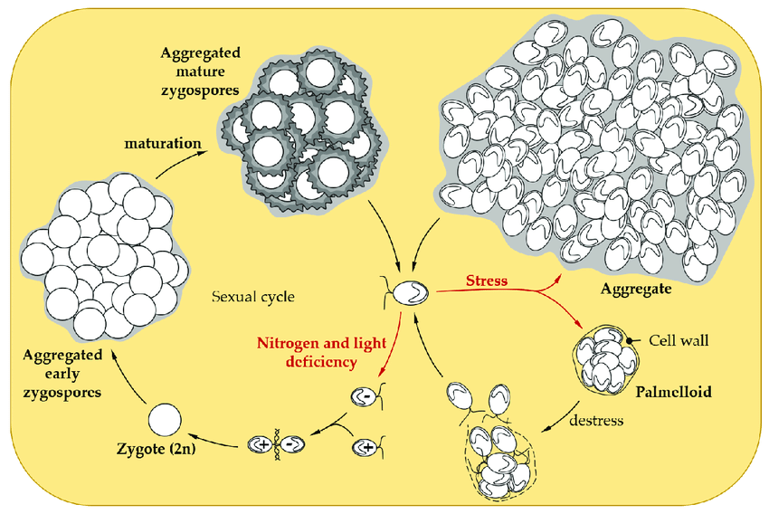

# Differential gene expression in three cell states

## Unicellular - Palmelloid - Multicellular state

Why looking at gene expression?

Image source: [Carpentier et al 2019 Cell](https://pubmed.ncbi.nlm.nih.gov/31652831/)

